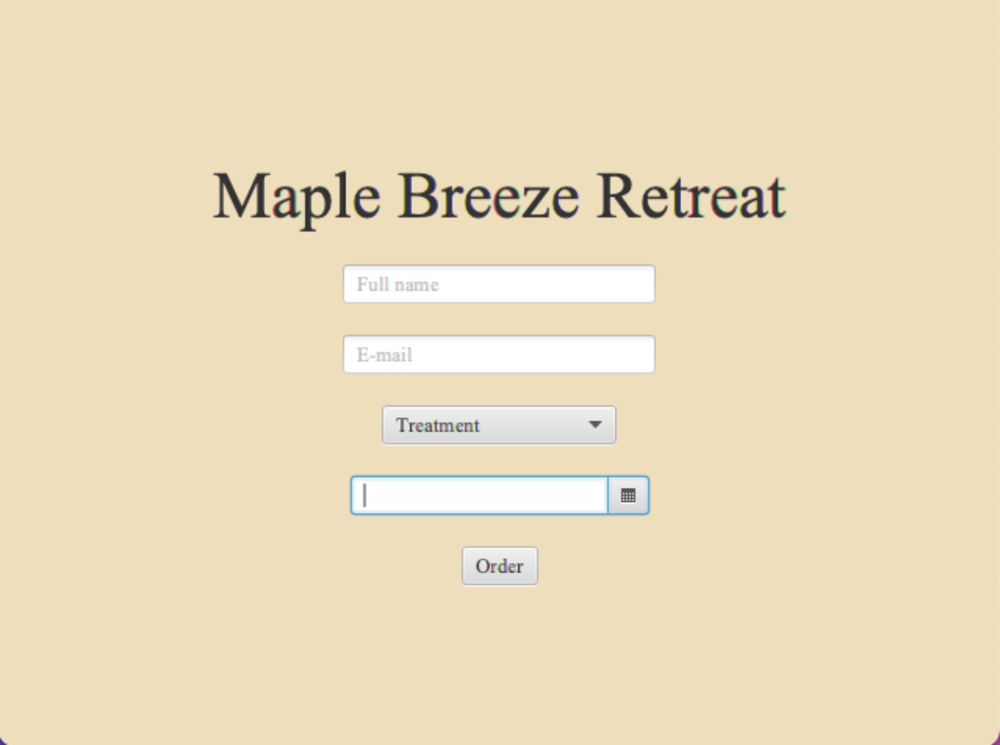
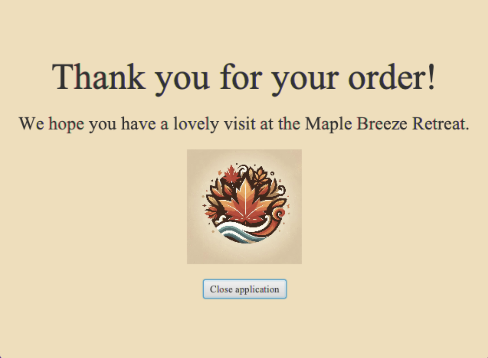
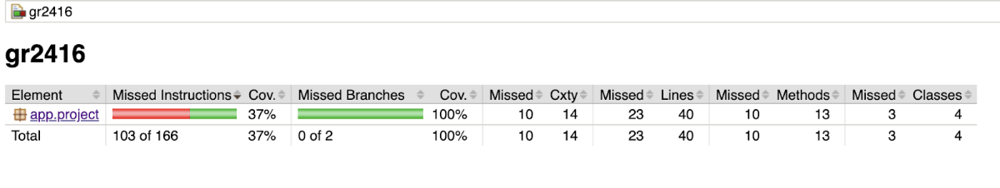
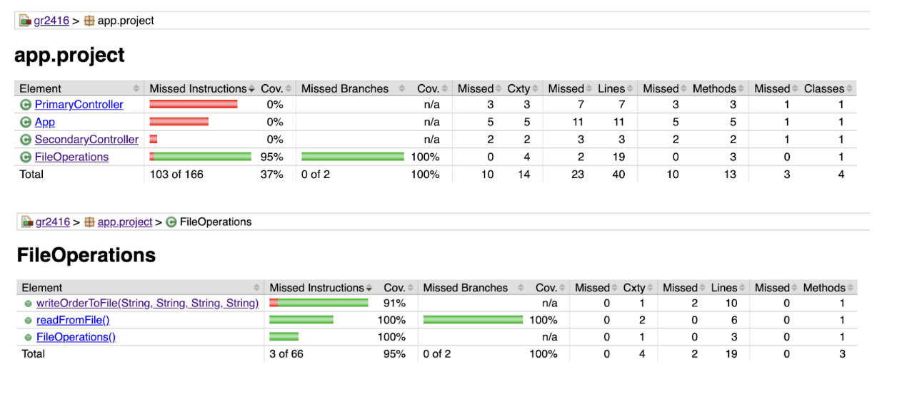
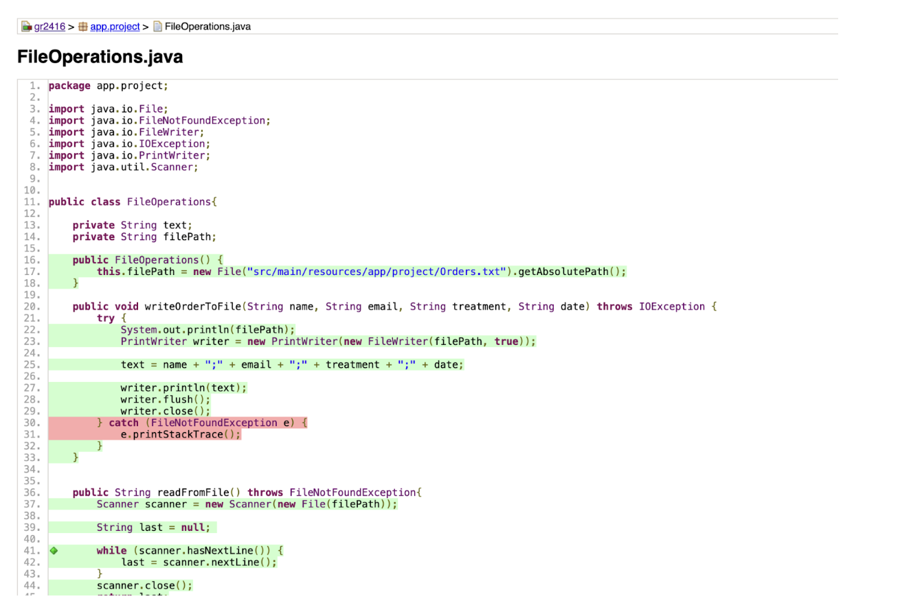

# Release 1

## Functionality of the app
We have created an app that will function as a spa booking page. In release one the app has two pages.

 

Page one has these functionalities:
* Field for name input
* Field for email input
* A treatmentpicker where you can choose only one treatment
* Calendar fuction where you can choose a date for your treatment

Page two has this functionaly:
* After your order you will get a confirmation 
* You can press a button that closes the application

## Key Files and Directories

Our project is mainly in the folder gr2416/src/main. From there the project is parted in two.

**gr2416/src/main/java/app/project..**
* **/App.java**: This class sets up the JavaFX application, loads an initial FXML file to define the UI, and provides a method to change the UI dynamically by loading different FXML files. This is the main entry point of the JavaFX application. 
* **/FileOperations.java**: This class is designed to handle file operations. This is done in the method writeOrderToFile(String name, String email, String treatment, String date). The method writes the name and email of the customer, the date of the treatment and order information to the file Order.txt-file. All the information is written in one line in the txt-file, seperatied by ";". The data is not saved until the button "order" is pressed.
* **/PrimaryController.java**: The class is a JavaFX controller that manages the primary view of the application. It handles user input, saves the order information to Order.txt by calling the writeOrderToFile method, and switch to a secondary view.
* **/SecondaryController.java**: This class is also a JavaFX controller, but this manages the secondary view of the application. It provides a method to close the application when triggered by when the user clicks the button "Close application".

**gr2416/src/main/resources/app/project**: 
* In this folder we have the FXML-files for the app, one folder for images, one txt-file and one style cheet (css-file) for the project.
* **images**: This is a folder where we can store images we need for the project. 
* **/Orders.txt**: The Orders.txt file contains order information in a structured format. Each line represents a single order, with fields separated by semicolons (;).
* **/primary.fxml**: This file defines the layout for the user interface using FXML via SceneBuilder. It defines the layout for the primary view of the application, and is managed by the PrimaryController class. Included components are labels, text fields, a combo box, a date picker, and a button. For additional styling we use an external stylesheet (style.css).
* **/secondary.fxml**: This does the same as primary.fxml, but for the secondary view of the JavaFX application. It contains a label for the "thank you"-message, an image view for displaying a logo, and a button to close the application. It is managed by the SecondaryController class, and for additional styling, we use the external stylesheet (style.css). 
* **/style.css**: The CSS file defines styles for the app. We define global and specific styles, like the font family, background color and drop shadow effect in text and buttons.

## User stories

### User Story 1: **Booking Selection**
As a user, I want to be able to book a treatment at a spa. I want to view a list of available treatments and choose the one that suits me best, as well as select a convenient date and time for my appointment.
**Acceptance Criteria:**
- The user can view a list of treatments.
- The user can select a treatment from the list.
- The user can choose a date for their appointment.
- The appointment selection is confirmed after choosing the treatment and the date.

"Booking selection" is the user story of the app as e hoal. We do not have one concrete issue tied up to this user story, as we did not start using issues in gitlab until after this was implemented in the code.  

---

### User Story 2: **Save Input to File**
As a user, I want my contact information and selected treatment to be stored, so my booking is linked to my name.
**Acceptance Criteria:**
- The user can input their contact information (name and email).
- The selected treatment is stored along with the contact information.
- The data is saved successfully in file. 

Link to issue: [Issue #1](https://gitlab.stud.idi.ntnu.no/it1901/groups-2024/gr2416/gr2416/-/issues/1). 

---

 
 

### Workflow
---

**Scrum**

During our Monday and Thursday meetings, we always start with a standup to clarify any necessary points related to the progress of the project. We discuss what we have accomplished since the last meeting, what we plan to do next, and any obstacles in our way.

Additionally, we have broken down user stories into smaller tasks to get a clear overview of what needs to be done, which aids our understanding of the functionality required for each issue. Our user stories are based on assumptions about what a user group would need to achieve, providing a basis for functional discussions.

Furthermore, we have started to gradually implement pair programming, where we collaborate on coding multiple tasks.

---
 

**Issues**

At the start of the project, we weren't aware that we needed to use issues, so they weren't introduced until later in the process. The first branches were named after the team members working on them, and commits were named based on the tasks we were handling, without being linked to any specific issues.

As we realized the importance of using issues, we took the time to learn how to implement them effectively. We then created issues for each problem we worked on and assigned them to the appropriate team members.

Moving forward, we plan to use issues from the very beginning. We will link them to user stories and provide more detailed descriptions of what each issue involves. This will include using acceptance criteria and checklists to ensure that each user story is properly completed.

---
 

**Eclipse Che**

Throughout the work on the project, we have repeatedly tried to open the app in Eclipse Che. We approached the problem in several ways. 
- At first, we thought it was an issue with the devfile.yaml, so we tried editing it in various ways. 
- We also asked for help from several fellow students and faculty staff.

 

When we try to open the project in Eclipse Che, it stops at step four, as shown in the image. The teaching assistant and learning assistants said that if it stops at this point, it is sufficient, as there have been quite a few issues with Eclipse Che.

---

 

## Testing 

Coverage rate (dekningsgrad): we tested 37% of the app as a whole. 99% of what is tested is the file structure.

---