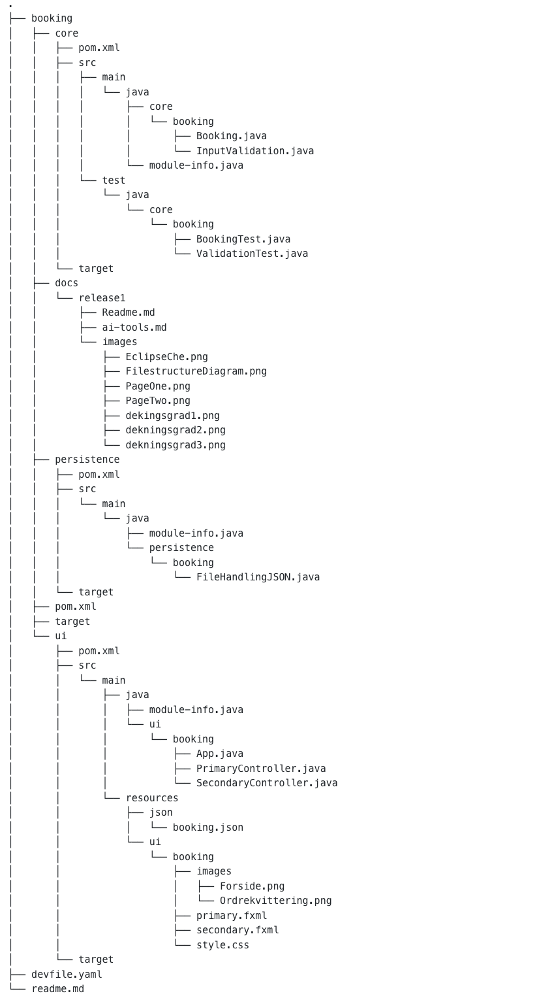

# Release 2

## Functionality of the app
We have created an app that will function as a spa booking page. In release two,  the app has two pages.


### Page one


Page One Functionality:
- **Name Input Field:**  
  Allows the user to enter their name.

- **Email Input Field:**  
  Allows the user to enter their email address.

- **Treatment Picker:**  
  A dropdown menu where the user can select one treatment.

- **Calendar Function:**  
  A date picker for selecting the treatment date.

<br>

### Invalid alert 


Input Validation:
  The form checks user inputs for correctness.

- **Name Field:**  
  Alerts the user if the name is invalid.

- **E-mail Field:**  
  Ensures the email format is correct.

- **Treatment Selection:**  
  The user must choose a treatment before proceeding.

- **Date Field:**  
  Requires a valid date to be selected.

- **Order Button:**  
  The button is disabled until all inputs are correct.

- **Real-time Feedback:**  
  The form provides immediate feedback as the user fills it out.

<br>Additionally, the form will not submit unless all fields are valid


<br>

### Page two


 Page Two Functionality:

- **Order Confirmation:**  
  After placing an order, the user receives a confirmation message.

- **Close Application Button:**  
  A button is available that allows the user to close the application.


<br>

## Necessary Versions and Dependencies

This application requires the following versions:

- **Java:** Version `21.0.1`
- **Maven:** Version `3.8.0`

Ensure you have these versions installed to successfully build and run the project.

<br>

## Building and Running the Application

The application uses Maven for building and running.

### Steps:

1. **Start in the `gr2416` folder:**
   - First, navigate to the `booking/` folder by using the command:
     ```bash
     cd booking
     ```

2. **Build the application:**
   - To compile the project, run the command:
     ```bash
     mvn clean compile
     ```
   - *(If you want to skip tests, you can add the flag `-DskipTests`)*.
   - After that, build and install the project by running:
     ```bash
     mvn clean install
     ```

3. **Run the GUI:**
   - Once the build is complete, navigate to the `ui/` folder using the command:
     ```bash
     cd ui
     ```
   - From there, run the GUI using the following command:
     ```bash
     mvn javafx:run
     ```

This is the complete process to build and run the project with or without tests.

<br>

# Documentation

## Key Changes for Release 2:

- **Modularized File Structure:**  
  Instead of having one main "src" folder, the project now has separate folders: `core`, `ui`, and `persistence`, each with their own `src` folder and `pom.xml` file.

- **Switched to JSON for File Handling:**  
  We now use JSON for file handling, replacing the previous `.txt` file. When you press the "Order" button on page one, your input is first validated and then saved to a JSON file.

- **Renamed Project Folder:**  
  The project folder name has been changed from `gr2416` to `booking`. Additionally, the subfolders previously named "project" have been renamed to "booking" throughout the file paths.

- **Design Changes:**  
  Major design updates have been made, including the addition of a background image on both pages and modifications to the `style.css` file.

- **Input Validation on Page One:**  
  Input validation has been added on page one. The validation logic is located in the `core` module, in a new file called `InputValidation.java`.

- **Expanded Testing:**  
  Additional tests have been added to cover more areas of the project.


<br>


## Key Files and Directories

**Full Three-Tier Architecture:** <br> We have followed the requirements for the file structure by having three main folders: `core`, `ui`, and `persistence`. This divides an application into three distinct layers: the presentation layer (ui), the application layer (core), and the data layer (persistence).

These folders are located in **gr2416/booking:**
 - core: `core/src/main/java/core/booking/`
 - ui: `ui/src/main/java/ui/booking/`
 - persistence:  `persistence/src/main-java/persistence/booking/`

<br>


## Contents of Our Modules:

### `booking/ui/src/main/java/ui/booking/..`

- **App.java:**  
  This class sets up the JavaFX application, loads the initial FXML file to define the UI, and provides a method to change the UI dynamically by loading different FXML files. It serves as the main entry point of the JavaFX application.

- **PrimaryController.java:**  
  This is a JavaFX controller class that manages the primary view of the application. It handles user input, saves the order information to `Order.txt` by calling the `writeOrderToFile` method, and switches to a secondary view.

- **SecondaryController.java:**  
  Another JavaFX controller class, this one manages the secondary view of the application. It provides functionality to close the application when the user clicks the "Close application" button.

### `booking/ui/src/main/resources/ui/booking/..`

In this folder, we have the FXML files for the app, as well as:
- **images:** A folder where we store images needed for the project.
- **style.css:** A stylesheet for defining the visual style of the app.

- **primary.fxml:**  
  This file defines the layout of the user interface using FXML through SceneBuilder. It defines the layout for the primary view, which is managed by the `PrimaryController` class. Included components are labels, text fields, a combo box, a date picker, and a button. For additional styling, we use the external stylesheet (`style.css`).

- **secondary.fxml:**  
  This file defines the layout for the secondary view of the application, which is managed by the `SecondaryController` class. It contains a label for the "thank you" message, an image view to display a logo, and a button to close the application. For additional styling, it also uses the external stylesheet (`style.css`).

- **style.css:**  
  The CSS file that defines the styles for the app. It includes global and specific styles such as font family, background color, and drop shadow effects on text and buttons.

## File Structure


- `core/src/main/java/core/booking/`: Contains the core logic of the application.

<br>


`ui/src/main/java/ui/booking`:  This is where the controller files for the GUI are located

- `/App.java`
- `/PrimaryController.java`
- `/SecondaryController.java`

<br>

in `/PrimaryController.java` a Booking-object is made 
<br>

## File Structure Diagram

Below is the file structure diagram, excluding autogenerated files such as `.gitignore`, `.vscode`, and `target`:




<br>

**Work Practices:**
  <br> We have created a `dev` branch for more stable development.
  
  The `master` branch is only merged when functionality is complete and tested. So that we ensure stability in the main codebase.


## Testing 

**Coverage rate** (dekningsgrad): we tested 100% of the core module, as we prioritized the highest to make sure the app was running as we wanted it to. The ui and persistence modules do not have their own tests yet, as we ran out of time and down-prioritized these to make sure our code quality was as high as possible. Going forward, we plan to prioritize making tests that cover all modules.

As we modulized our project, we realized JaCoCo rapports were only being made for the module(s) that included at least one test. That is why we only have the rapport for the core module.


## User stories

### User Story 1: **Booking Selection**
As a user, I want to be able to book a treatment at a spa. I want to view a list of available treatments and choose the one that suits me best, as well as select a convenient date and time for my appointment.
**Acceptance Criteria:**
- The user can view a list of treatments.
- The user can select a treatment from the list.
- The user can choose a date for their appointment.
- The appointment selection is confirmed after choosing the treatment and the date.

"Booking selection" is the user story of the app as a whole. We do not have one concrete issue tied up to this user story, as we did not start using issues in gitlab until after this was implemented in the code.  

---

### User Story 2: **Save Input to File**
As a user, I want my contact information and selected treatment to be stored, so my booking is linked to my name.

**Acceptance Criteria:**
- The user can input their contact information (name and email).
- The selected treatment is stored along with the contact information.
- The data is saved successfully in file. 

Link to issue: [Issue #24](https://gitlab.stud.idi.ntnu.no/it1901/groups-2024/gr2416/gr2416/-/issues/24). 


### User Story 3: **Booking Confirmation**
As a user, I want to receive a thank you message after successfully placing a booking, so that I know my appointment has been confirmed.

**Acceptance Criteria:**
- The user receives a thank you message after placing a booking.
- The confirmation is shown on the second page after submitting the booking.
- *(Future Improvement)* The details of the selected treatment and appointment date are not yet displayed.


## Workflow


### Scrum
During each of our meetings, we always start with a standup to clarify any necessary points related to the progress of the project. We discuss:
- What we have accomplished since the last meeting
- What we plan to do next
- Any obstacles in our way

<br>

We have adapted **pair programming**, which has made collaboration on larger tasks much easier. 
- We've utilized pair programming by working together on a single computer, as well as using the Live Share extension in VS Code, enabling us to code together in real time on our own computers.

<br>

### Issues and Commits

At the start of the project, we created issues that we thought would cover everything we needed to proceed. However, this resulted in the issues being quite large and complex, making it difficult to work simultaneously, as we were dependent on each other's changes. In addition, every issue is tied up to milestone 2 in gitlab. 

In the beginning of Assignment 2, we were also unaware of how to write commits in a clear and organized manner. After consulting with a teaching assistant, we learned how to properly link commits to issues. As a result, we didn’t implement this practice until the end of Assignment 2.

For the next assignment (Assignment 3), we plan to:
- Create smaller, more focused issues with multiple commits per issue
- Use the format `feat(#branch-number): description of the change made` for each commit
- Commit more frequently whenever a change is made

These adjustments will help make the project more organized and easier to manage.

### Other adjustment
In Release 1, we used both Norwegian and English interchangeably. In this release, we have made an effort to be consistent by using English as our main language for everything. We have successfully implemented this across all platforms, except for some issues on GitLab. The issues created early in the process for Release 2 are still in Norwegian


## Eclipse Che

Throughout the project, we have repeatedly tried to open the app in Eclipse Che. We approached the problem in several ways:
- Initially, we thought the issue was with the `devfile.yaml`, so we tried editing it in various ways.
- We also asked for help from several fellow students and faculty staff.

<br>


When we try to open the project in Eclipse Che, it stops at step four, as shown in the image. The teaching assistant and learning assistants said that if it stops at this point, it is sufficient, as there have been quite a few issues with Eclipse Che.

