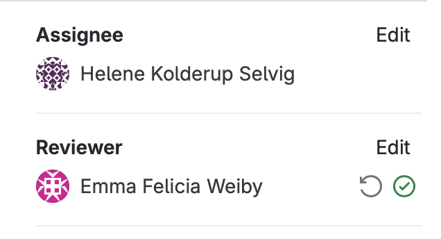

# Spa Booking Application - Release 3


## Table of Contents

1. [Overview](#overview)
2. [Project Architecture](#project-architecture)
3. [Necessary Versions and Dependencies](#necessary-versions-and-dependencies)
4. [Building and Running the Application](#building-and-running-the-application)
5. [New Features in Release 3](#new-features-in-release-3)
    - [Key Decisions and Focus Areas](#key-decisions-and-focus-areas)
    - [Code Quality and Workflow Improvements](#code-quality-and-workflow-improvements)
    - [User Story Alignment and Feature Enhancements](#user-story-alignment-and-feature-enhancements)
6. [Architecture and Modules](#architecture-and-modules)
7. [REST Services](#rest-services)
    - [Available Endpoints](#available-endpoints)
8. [Functionality of the App](#functionality-of-the-app)
    - [Page One: Booking Form](#page-one-booking-form)
    - [Page Two: Order Confirmation](#page-two-order-confirmation)
    - [Page Three: Receipt](#page-three-receipt)
9. [File Handling](#file-handling)
10. [Key Changes for Release 3](#key-changes-for-release-3)
11. [Key Files and Directories](#key-files-and-directories)
12. [User Stories](#user-stories)
    - [User Story 1: Booking Selection](#user-story-1-booking-selection)
    - [User Story 2: Save Input to File](#user-story-2-save-input-to-file)
    - [User Story 3: Booking Confirmation](#user-story-3-booking-confirmation)
13. [Mapping Between User Stories and Application Pages](#mapping-between-user-stories-and-application-pages)
14. [Workflow](#workflow)
    - [Agile Methodology and Team Practices](#agile-methodology-and-team-practices)
    - [Git Workflow and Team Practices](#git-workflow-and-team-practices)
15. [Modularization Complexity](#modularization-complexity)
16. [Contribution](#contribution)
17. [Sustainability](#sustainability)
18. [Learning Experiences](#learning-experiences)
19. [Declaration of AI Assistance Use](#declaration-of-ai-assistance-use)
20. [Shippable Product](#shippable-product)

#


## Overview


The **Spa Booking Application** is a modularized Java project designed to provide a streamlined interface for booking spa treatments. 

It combines a **JavaFX-based graphical user interface (GUI)** for user interaction with **Spring Boot** for managing RESTful services, which enhances the system's scalability and maintainability.

## Project Architecture

The project follows a **three-tier architecture** and is divided into four distinct modules:

- **Core**: Manages the core business logic, including input validation and booking rules.

- **UI**: Implements the graphical user interface using JavaFX and FXML, providing an intuitive user experience.

- **Persistence**: Handles data storage and retrieval by utilizing JSON files for flexible and easily readable data management.
- **Spring Boot REST Server**: Offers RESTful services to facilitate communication between the backend and UI, allowing bookings to be created, retrieved, and managed via HTTP requests.

<br>

## Necessary Versions and Dependencies

This application requires the following versions:
- **Java**: Version `17.0.1`
- **Maven**: Version `3.8.0`

These versions must be installed to successfully build and run the project.

## Building and Running the Application

The application uses Maven for building and running.

### Steps:
1. Navigate to the `booking` directory.  
2. Compile the project using `mvn clean compile`.  
   To skip tests, use the flag `-DskipTests`.  
3. Build and install the modules with `mvn clean install`.  
4. Run the RESTful server by navigating to the springboot/restserver module with `cd springboot/restserver/`, and executing `mvn spring-boot:run`.  
5. Open a new terminal
6. Navigate to the ui module using `cd ui/`
7. Then run the application with `mvn javafx:run`.


## New Features in Release 3

**REST API Overview**

Release 3 introduces a REST API to enhance the system's extensibility and streamline communication between components. The REST API is built using **Spring Boot**, enabling seamless interaction between the server-side logic and the client application.

The API provides endpoints for managing bookings, including creating new bookings, retrieving existing bookings and retrive booking(s) tied to one uniqe email. The BookingRestController manages these endpoints, while BookingRestService handles the business logic behind each operation. Additionally, an ApiClient is implemented to simplify communication between the client-side and the server, ensuring a consistent and modular approach to data management.

More advnaced description in the [REST Services](#rest-services) section.


#
#### Key Decisions and Focus Areas

In this release, we chose to build upon the existing **JavaFX application**, expanding its functionality rather than transitioning to a new client technology. This decision reflects our commitment to prioritizing **quality over quantity**, ensuring robust and maintainable code rather than rushing into a technology shift
#
#### Code Quality and Workflow Improvements

Our team focused on:
- **Improving code quality** by adhering to best practices.
- **Establishing good working habits**, including:
  - Efficient use of issues for task tracking
  - Implementing effective branching strategies in Git

This approach allowed us to maintain high standards for both **code quality** and **workflow efficiency**, while extending the application's functionality


Links for more details on the topics: 

[Issue Management](#issue-management)

[Branching Strategy](#branching-strategy)


#
#### User Story Alignment and Feature Enhancements

We expanded the application's features in alignment with **User Story 3**:
- **Booking Confirmation**:  
  - Users now receive a confirmation message after successfully booking a treatment  
  - They can navigate to the receipt page for further details  

  

This enhancement significantly improves the **user experience**, offering more transparency and reassurance during the booking process

[User Story 3: Booking Confirmation](#user-story-3-booking-confirmation)

<br>

## Architecture and Modules
 
The Spa Booking Application follows a modular architecture, divided into the following components:

- **UI Module**: Handles user interactions and provides the graphical interface using JavaFX.
- **Core Module**: Contains the core business logic, including booking validation and processing
- **Persistence Module**: Manages data storage, ensuring bookings are saved and retrieved correctly using JSON files
- **REST Module**: Implements RESTful services to allow interaction between the client and server

Below is the package diagram illustrating the organization and interaction between the modules:


### Explanation:
- The **UI module** depends on the **Core module** for accessing business logic.
- The **Core module** interacts with the **Persistence module** for data storage and retrieval.
- The **REST module** provides APIs to external systems and also interacts with the **Core module** for business logic.

<br>

## REST Services

The application includes RESTful services that enable external systems to interact with the booking system. These services handle requests such as creating new bookings or retrieving existing ones.

### ApiClient.java
The ApiClient class is responsible for facilitating communication between the JavaFX client and the REST API. It uses Java's HttpClient to make HTTP requests, supporting GET, POST, PUT, and DELETE methods, even though only get() and post() are currently used by the application. This design allows for easy expansion of the app's functionality in the future, with methods ready for more advanced operations.

### BookingRestController.java
The BookingRestController class defines the REST API endpoints for managing bookings. It exposes several endpoints using annotations like @GetMapping and @PostMapping.


**Available Endpoints**:

- **GET /api/bookings**: Retrieves all bookings.
- **POST /api/bookings/add**: Creates a new booking.
- **GET /api/bookings/email**: Retrieves bookings based on the email associated with the most recent addition. If there are several bookings made by the same email, it will give a list over all bookings tied up to this users email.

This controller works in conjunction with BookingRestService to handle the business logic, allowing clients to easily interact with the booking system.

### BookingRestService.java
The BookingRestService class contains the core logic for managing bookings. It acts as a service layer that processes booking-related operations, such as adding new bookings and loading all bookings from the persistence layer (BookingService). By separating the business logic from the REST controller, the system maintains a clear separation of concerns, improving modularity and testability.

**1. POST /api/bookings/add**: Adds a new booking. Sends a POST request with a JSON body to create new data. <br>

  
**Example**
  
  
   ```json
   {
   "bookingNumber" : 1,
   "name": "Jane Doe",
   "email": "jane@example.com",
   "treatment": "Pedicure",
   "date": "2024-12-01"
   }
   ```
##
**2. GET/api/bookings**: Retrieves all bookings
<br>To retrieve all bookings, the `GET/api/bookings` endpoint is used. Retrieves all bookings.


**Example**

  
   ```json
   [ {
    "bookingNumber" : 1,
    "name": "Jane Doe",
    "email": "jane@example.com",
    "treatment": "Pedicure",
    "date": "2024-12-01"
   }, {
    "bookingNumber" : 2,
    "name": "Kari Nordmann",
    "email": "kariNord@hotmail.com",
    "treatment": "Manicure",
    "date": "2024-12-13"
   } ]
   ```

##

**3. GET /api/bookings/email**: Retrieves bookings filtered by email

To retrieve bookings filtered by email, use the `GET /api/bookings/email` endpoint. Below is an example of how this endpoint looks when "perp@gmail.com" have done the recent booking and he have two bookings:

**Example**

   ```json
   [ {
    "bookingNumber" : 4,
    "name": "Per Person",
    "email": "perp@gmail.com",
    "treatment": "Hot stone massage",
    "date": "2024-12-02"
   }, {
    "bookingNumber" : ,
    "name": "Per Person",
    "email": "perp@gmail.com",
    "treatment": "Manicure",
    "date": "2024-12-07"
   } ]
```

##
Below is the sequence diagram showing the workflow for creating a new booking via the REST API:


### Explanation:
1. The user inputs details such as name, email, treatment, and date in the UI.
2. The **PrimaryController** calls the **BookingService** to create a booking object.
3. The **BookingService** interacts with the **BookingRepository** to save the booking data to a JSON file.
4. The **PrimaryController** sends a `POST` request to the REST endpoint (`/api/bookings/add`) via the **BookingRestService**.
5. The REST server validates and processes the booking.
6. A confirmation message is displayed to the user.


## Functionality of the App

We have created an app that functions as a spa booking page. In Release 3, the app now has three pages, each providing specific functionality.

### Page One: Booking Form


Page One Functionality includes a form where users can input:
- **Name**: Validated to ensure it is non-empty and in a proper format.
- **Email**: Checked for valid format.
- **Treatment**: Selectable from a dropdown list.
- **Date**: Ensures the selected date is not in the past.
- **Real-Time Feedback**: Provides immediate validation feedback.

#### Linked User Stories:
- [User Story 1: Booking Selection](#user-story-1-booking-selection)
- [User Story 2: Save Input to File](#user-story-2-save-input-to-file)


### Invalid alert


The form ensures:
- The name field alerts the user if the name is invalid.
- The email field ensures the email format is correct.
- The treatment field requires the user to select a treatment.
- The date field prevents selecting dates in the past.
- The order button is disabled until all inputs are correct.

Additionally, the form will not submit unless all fields are valid.

### Page Two: Order Confirmation


Page Two Functionality provides:
- **Order Confirmation**: Displays a thank-you message after successful booking.
- **Show Receipt Button**: Navigates to Page Three.
- **Close Application Button**: Exits the application.

#### Linked User Stories:
- [User Story 3: Booking Confirmation](#user-story-3-booking-confirmation)

### Page Three: Receipt


Page Three displays the user’s receipt details after clicking the Show Receipt button.  
It also includes a **Close Application Button** to exit the application.

#### Linked User Stories:
- [User Story 3: Booking Confirmation](#user-story-3-booking-confirmation)


## File Handling

All bookings are stored in `booking.json` located in `persistence/data/`.  
The JSON format replaced the previous `.txt` format, improving data flexibility and consistency.

## Key Changes for Release 3

- **Expanded File Structure**: The project has been modularized further into `core`, `ui`, `persistence`, and `springboot/restserver`.
- **RESTful Services**: Introduced endpoints for adding and retrieving bookings.
- **Improved UI**: Updated layout and navigation for a smoother user experience.

## Key Files and Directories

**Full Three-Tier Architecture**:
The application is divided into three main layers:
- **Core Module**: `core/src/main/java/booking/core/`
- **UI Module**: `ui/src/main/java/booking/ui/`
- **Persistence Module**: `persistence/src/main/java/booking/persistence/`
As well as an integration (between service and presentation) layer/API layer:
- **Spring Boot REST Server**: `springboot/restserver/src/main/java/booking/springboot/restserver/`

### Contents of the Modules

- **Core**: Contains business logic and input validation.
- **UI**: Handles the graphical user interface with FXML files for pages.
- **Persistence**: Manages data storage in JSON format.
- **Spring Boot REST Server**: Provides RESTful API for external interactions.

## File Structure

```java
gr2416/
├── booking/
│   ├── core/
│   │   └── src/
│   │       └── main/
│   │           └── java/
│   │               └── core/
│   │                   └── booking/
│   │                       ├── Booking.java
│   │                       └── InputValidation.java
│   ├── persistence/
│   │   ├── src/
│   │   │   └── main/
│   │   │       └── java/
│   │   │           └── booking/
│   │   │               └── persistence/
│   │   │                   ├── ApiClient.java
│   │   │                   └── BookingService.java
│   │   └── data/
│   │       └── booking.json
│   ├── springboot/
│   │   └── restserver/
│   │       └── src/
│   │           └── main/
│   │               └── java/
│   │                   └── booking/
│   │                       └── springboot/
│   │                           └── restserver/
│   │                               ├── BookingRestController.java
│   │                               ├── BookingRestService.java
│   │                               └── RestApplication.java
│   ├── ui/
│   │   ├── src/
│   │   │   └── main/
│   │   │       └── java/
│   │   │           └── booking/
│   │   │               └── ui/
│   │   │                   ├── App.java
│   │   │                   ├── PrimaryController.java
│   │   │                   ├── SecondaryController.java
│   │   │                   └── TertiaryController.java
│   │   └── resources/
│   │       └── booking/
│   │           └── ui/
│   │               ├── primary.fxml
│   │               ├── secondary.fxml
│   │               ├── tertiary.fxml
│   │               ├── style.css
│   │               └── images/
│   │                   └── (images)
├── readme.md
```

The structure includes core logic, RESTful services and UI components


## Testing


**JaCoCo Reports** were used to verify test coverage


## Core testcoverage : ##


- The **Core Module** achieved 100% test coverage using JUnit.

## Persistence testcoverage : ##


The test coverage in the persistence module is lower than we aimed for. We faced challenges due to the BookingService containing a bit too much logic, which made it difficult to thoroughly test. This resulted in some complexities when trying to isolate and verify specific behaviors within the service. In the future, we aim to refactor the code to achieve better separation of concerns, which would make testing more manageable and improve overall test coverage.


## Springboot testcoverage : ##


- The **Springboot Module** achieved 100% test coverage using JUnit.


## UI testcoverage : ##


- The **UI Module** achieved 78% test coverage using JUnit 

UI test 


PrimaryController 


SecondaryController 


TertiaryController 


App


### Challenges of Testing the Main Method in JavaFX Applications

In JavaFX applications, it is challenging to test the main method directly because it calls Application.launch(), which can only be invoked once per JVM. This limitation in the JavaFX framework means that subsequent calls to launch() in a testing environment may result in exceptions and unpredictable behavior. Additionally, Application.launch() is a blocking method that starts the JavaFX thread and does not return until the application exits, which disrupts the flow of unit tests. Due to these technical constraints, we lack coverage for the main method. Instead, we have focused on testing the start() method, which sets up the application’s scene and window. This allows us to verify that the application initializes correctly and loads necessary UI components without encountering the issues associated with testing the mainmethod.

[Learning experiences](#learning-experiences)


## User Stories

### User Story 1: Booking Selection

As a user, I want to book a treatment at a spa.  
Acceptance criteria:
- View available treatments.
- Select a treatment and a valid date.
- Confirm the booking.


Linked Scene:
Page One (Booking Form): This story corresponds to the booking form where users input their treatment choice, name, email, and date

#
### User Story 2: Save Input to File

As a user, I want my booking details stored securely in a file.  
Acceptance criteria:
- Input contact information (name and email).
- Save data to `booking.json`.

Linked Scene: 
This story corresponds to the logic behind the "Order" button on Page One, where user inputs are validated and securely stored


#
### User Story 3: Booking Confirmation

As a user, I want to receive confirmation after booking.  
Acceptance criteria:
- Display a thank-you message.
- Navigate to the receipt page after confirmation.

Linked Scene: Page Two (Order Confirmation): This story corresponds to the thank-you message displayed after a booking is completed and the navigation logic to Page Three (Receipt).


## **Mapping Between User Stories and Application Pages**

| **User Story**        | **Linked Application Page**                      |
|------------------------|-------------------------------------------------|
| User Story 1          | [Page One: Booking Form](#page-one-booking-form)    |
| User Story 2          | [Page One: Booking Form](#page-one-booking-form)    |
| User Story 3          | [Page Two: Order Confirmation](#page-two-order-confirmation), [Page Three: Receipt](#page-three-receipt) |

# 

# Workflow


## Agile Methodology and Team Practices

### Scrum Approach
We adopted the **Scrum** methodology, drawing inspiration from Henrik Kniberg's *Scrum and XP from the Trenches*. Our approach included well-defined **sprints**, **stand-up meetings**, and an emphasis on **continuous improvement**.

### Sprint Planning and Stand-Ups
We conducted **sprint planning** to clarify tasks and align goals. Daily **stand-up meetings** kept us updated on progress, plans, and blockers. As Kniberg emphasizes, these retrospectives allowed us to learn and improve incrementally.

#
### Collaboration Practices

#### Pair Programming
We heavily used **pair programming** for complex tasks, following Kniberg's recommendation to ensure quality and share knowledge. We utilized **Live Share in VS Code** to enable real-time collaboration.

During pair programming, we sometimes forgot to include Co-authored-by tags in commits, especially for tasks that took several days. This was an oversight despite equal collaboration.

* Lesson Learned:
We realized the importance of maintaining consistent documentation during long tasks.

* Future Improvement:
For future sprints, we’d review commits for missing tags, acknowledge contributions retroactively, and use a checklist to ensure tags, such as Co-authored-by, are added consistently.


#
#### Branching Strategy
We maintained a `dev` branch for ongoing work, merging into `master` only after reviews upon closing releases. This was to ensure an always working branch, as well as a branch for testing out new implementations and features. We used **merge requests** for code reviews, ensuring that all changes were checked by a teammate before integration, which aligns with Kniberg’s view on involving all team members in quality assurance.

[Code reviews](#code-reviews)


Each issue in our project has been assigned a corresponding branch with a descriptive and clear name. This practice ensures that all team members can easily understand which task is being worked on and track its progress. By maintaining a logical and consistent branch naming convention, we have improved the overall organization and clarity of the project.


This approach has made it easier to navigate the repository, review code changes, and maintain a clear development workflow, ultimately contributing to better team collaboration and project management

### Milestones and Releases  

Our project was structured around three milestones, each aligned with a specific release to ensure focus and steady progress  


1. **Release 1** (Sep 16 – Sep 19, 2024):  
   Initial setup, including repository creation, architecture design, and foundational components.  
   **Completion:** 8/8 tasks, 100%.  

2. **Release 2** (Sep 26 – Oct 10, 2024):  
   Focused on core functionality like booking logic, data persistence, and UI enhancements.  
   **Completion:** 17/17 tasks, 100%.  

3. **Release 3** (Oct 11 – Nov 14, 2024):  
   Advanced features such as REST APIs, improved modularity, and page navigation.  
   **Completion:** 30/30 tasks, 100%.  


### Why Milestones?  
Inspired by Henrik Kniberg's emphasis on iterative development in *Scrum and XP from the Trenches*, we used milestones to break the project into manageable chunks. 

This allowed us to focus on delivering value incrementally while continuously evaluating progress. 
- By tying tasks to specific milestones, we ensured clear priorities and effective collaboration within the team.  

**This approach helped us identify and resolve issues early, maintain momentum, and produce high-quality deliverables at each stage of the project.


#
### Quality as a Priority
In line with Kniberg’s philosophy, **quality was non-negotiable**. We upheld high internal quality by keeping the codebase clean, following best practices, and refactoring when needed to ensure long-term maintainability and stability.

### Code Quality Tools

To ensure good code quality that is easily maintainable and readable, we have implemented and used tools like **Language Support for Java by Red Hat**, **SpotBugs**, and **Checkstyle**.

#### How to Run

To run these tools, you can use the following Maven commands:

### SpotBugs
Run SpotBugs to analyze the code for potential bugs and issues:

```bash
mvn spotbugs:check
```

### Checkstyle
Use Checkstyle to enforce consistent coding standards:

```bash
mvn checkstyle:check
```

### JaCoCo
Generate a code coverage report using JaCoCo:

```bash
mvn jacoco:prepare-agent test jacoco:report
```


*More about code quality tools used here : [Code Quality](#Other-Git-tools-to-ensure-code-quality)* 

#
### Cross-Disciplinary Collaboration
Our team worked cross-functionally, integrating **design, development, and testing** into our workflow. This approach ensured flexibility, supported prompt issue resolution, and enhanced the overall quality of our deliverables.


## Git Workflow and Team Practices

In our development process, we adhered to well-defined practices for handling issues, commits, and merges to ensure high-quality code and efficient collaboration.

---

## **Issue Management**

We actively used issues as the foundation of our development workflow. All code changes were directly linked to specific issues, providing a clear record of what was done and why. To maintain consistency and clarity, we adopted a shared format for creating issues, which included the following components:

- **Title**: A short, concise description of the problem or task.
- **Description**: A detailed explanation of the task and its objectives to align the team’s understanding.
- **Goal**: Each issue began with a clear goal to outline its purpose.
- **Assignee**: Assigned the issue to the responsible team member.
- **Labels**: Categorized issues (e.g., test, rest-api, documentation).
- **Due Date**: Set deadlines to track progress effectively.

### **Example of Issue Format**
- **Title**: Short description of the issue.  
- **Description**: I'm going to create a new issue in my Git repository that is going to XX (well-described task)

**Example Issue from our gitlab**


*Our labels within the project* 


We also used a shared template to maintain a standardized approach across the team.

---

## **Commit Guidelines**

We followed **Conventional Commits** for all commit messages to ensure a consistent, structured, and informative history. This practice made it easier to understand the purpose of each commit and link it to specific issues.

#### **Commit Format**
- **Type**: Indicated the change type (e.g., `feat` for a new feature, `fix` for bug fixes)
- **Gitmoji**: Added relevant emojis for visual clarity (e.g., ✨ for new features, 🔧 for build changes)
- **Scope**: Focused on the specific change; no detailed scope was set.
- **Commit Title**: Included the issue number followed by a concise summary
- **Detailed Commit Message**: Provided additional details if necessary 
- **Co-authored-by**: Added this tag to acknowledge paired contributions 

#### **Commit Example**
```plaintext
feat✨ #23:commit title 
despription

Co-authored-by: studentname <mail@stud.ntnu.no>
```
#
<br>

**Examples from our own commits**


#
**Co-authored commits**


#

### Other Git tools to ensure code quality

**Merge**


*Descriptions on what the new code adds to the project* 

! The new code will not be merged before it is reviewed

#

**Code reviwes**

We have used code reviews within the group to improve code quality by providing feedback, identifying issues, and sharing best practices. This collaborative process has helped ensure cleaner, more maintainable, and higher-quality code


*All the merged branches have been reviwed and approved by antother team member*




#

### Modularization Complexity

Adopting a modular structure required careful management of dependencies and coordination across modules.  
Actions taken:
- Used Maven for dependency management.
- Created separate `pom.xml` files for each module.  
Lessons learned:
- Modularization enhances organization but requires meticulous planning.

## Contribution

The contributions of team members are documented in `release3/contribution.md`.

Link: [Contributions](release3/contribution.md)

## Sustainability

Reflections on sustainability are documented in `release3/sustainability.md`.

Link: [Sustainability](release3/sustainability.md)


Description of the SusAd diagram with detailed explanation of each connection

## SusAD Diagram: Dimension Connections Explained

### Environmental Dimension
#
### 1. Reduced Resource Usage to Digital Solutions Reduce Waste
**Arrow Direction**: From **Reduced Resource Usage** (Immediate) to **Digital Solutions Reduce Waste** (Enabling).

- Optimizing API calls immediately reduces energy consumption, and over time, this enables more efficient digital processes that reduce waste by replacing paper-based workflows.
#
### 2. Digital Solutions Reduce Waste to Promotes Sustainable Norms
**Arrow Direction**: From **Digital Solutions Reduce Waste** (Enabling) to **Promotes Sustainable Norms** (Systemic).

- Reducing waste through digital solutions helps foster broader acceptance of environmentally friendly practices within the industry, leading to sustainable norms over time.
#
## Economic Dimension

### 1. Improved Workflow through Automation to Long-term Cost Savings
**Arrow Direction**: From **Improved Workflow through Automation** (Immediate) to **Long-term Cost Savings** (Enabling).

- The automation of workflows leads to immediate improvements by reducing manual labor, which over time results in reduced operational overhead and significant cost savings.
#
### 2. Long-term Cost Savings to Increased Attractiveness and Cost Efficiency
**Arrow Direction**: From **Long-term Cost Savings** (Enabling) to **Increased Attractiveness and Cost Efficiency** (Systemic).

- Cost savings from efficient resource management make the booking system economically more attractive, enhancing customer loyalty and supporting long-term economic growth.
#
## Social Dimension

### 1. Building Trust and Safety to Establishing Privacy Norms
**Arrow Direction**: From **Building Trust and Safety** (Immediate) to **Establishing Privacy Norms** (Enabling).

- Implementing privacy measures to build trust has an immediate impact on user safety, which eventually helps establish societal norms that value data privacy.
#
### 2. Establishing Privacy Norms to Positive Societal Impact
**Arrow Direction**: From **Establishing Privacy Norms** (Enabling) to **Positive Societal Impact** (Systemic).

- Once privacy norms are well-established, they have a broader impact on societal expectations for digital services, creating a positive societal impact regarding data security and ethical digital practices.
#
## Individual Dimension

### 1. User Convenience and Choice to Enhanced User Control
**Arrow Direction**: From **User Convenience and Choice** (Immediate) to **Enhanced User Control** (Enabling).

- By providing users with options, such as requesting receipts, immediate convenience is provided. This leads to enhanced user control over their data and interactions.
#
### 2. Enhanced User Control to Promotes Digital Rights
**Arrow Direction**: From **Enhanced User Control** (Enabling) to **Promotes Digital Rights** (Systemic).

- Giving users control over their data ultimately contributes to promoting digital rights, establishing norms around user autonomy and freedom in the digital space.
#
## Technical Dimension

### 1. Robust Architecture for Improved Performance to Modularity and Scalability
**Arrow Direction**: From **Robust Architecture for Improved Performance** (Immediate) to **Modularity and Scalability** (Enabling).

- Implementing a robust system architecture immediately improves performance. This approach enables modularity and scalability, ensuring the system can adapt to future changes.
#
### 2. Modularity and Scalability to Industry Standard and Best Practices
**Arrow Direction**: From **Modularity and Scalability** (Enabling) to **Industry Standard and Best Practices** (Systemic).

- Building a scalable system that is easy to update and maintain contributes to establishing industry best practices, supporting long-term technical sustainability across the sector.
#
## Cross-Dimensional Connections

### 1. Environmental to Economic
**Arrow Direction**: From **Promotes Sustainable Norms** (Systemic - Environmental) to **Improved Workflow through Automation** (Immediate - Economic).

- Sustainable practices can create efficiencies that positively impact the economy. For example, reducing resource usage helps streamline operations, which directly contributes to improved workflow and cost savings in the Economic dimension.
#
### 2. Technical to Social
**Arrow Direction**: From **Industry Standard and Best Practices** (Systemic - Technical) to **Building Trust and Safety** (Immediate - Social).

- Adhering to industry standards and implementing best practices directly improves system reliability and security, which immediately builds trust and enhances safety for users.
#

## Summary for the diagram 

- The arrows between [**Reduced Resource Usage**](#1-reduced-resource-usage-to-digital-solutions-reduce-waste), [**Digital Solutions Reduce Waste**](#2-digital-solutions-reduce-waste-to-promotes-sustainable-norms), and [**Promotes Sustainable Norms**](#2-digital-solutions-reduce-waste-to-promotes-sustainable-norms) show the development from short-term efficiency improvements to long-term sustainable industry norms.

- In the **Economic** dimension, arrows illustrate the progression from [**Improved Workflow through Automation**](#1-improved-workflow-through-automation-to-long-term-cost-savings) to [**Long-term Cost Savings**](#2-long-term-cost-savings-to-increased-attractiveness-and-cost-efficiency), and further to [**Increased Attractiveness and Cost Efficiency**](#2-long-term-cost-savings-to-increased-attractiveness-and-cost-efficiency).

- The **Social** dimension arrows demonstrate how [**Building Trust and Safety**](#1-building-trust-and-safety-to-establishing-privacy-norms) leads to [**Establishing Privacy Norms**](#1-building-trust-and-safety-to-establishing-privacy-norms), which ultimately influence [**Positive Societal Impact**](#2-establishing-privacy-norms-to-positive-societal-impact).

- In the **Individual** dimension, [**User Convenience and Choice**](#1-user-convenience-and-choice-to-enhanced-user-control) enhances [**User Control**](#1-user-convenience-and-choice-to-enhanced-user-control), which promotes broader [**Digital Rights**](#2-enhanced-user-control-to-promotes-digital-rights).

- The **Technical** dimension arrows show the connection between [**Robust Architecture**](#1-robust-architecture-for-improved-performance-to-modularity-and-scalability) and [**Modularity and Scalability**](#1-robust-architecture-for-improved-performance-to-modularity-and-scalability), further establishing [**Industry Standard and Best Practices**](#2-modularity-and-scalability-to-industry-standard-and-best-practices) to promote long-term sustainability.

- The [**Cross-dimensional arrows**](#cross-dimensional-connections) illustrate how systemic improvements in one dimension (like [**Promotes Sustainable Norms**](#2-digital-solutions-reduce-waste-to-promotes-sustainable-norms) in the Environmental dimension) can directly impact another (like [**Improved Workflow through Automation**](#1-improved-workflow-through-automation-to-long-term-cost-savings) in the Economic dimension).


<br>

# Learning experiences
### *What we would have done differently if we were to continue the project*
Looking back, we realize that there were areas where we could have improved our approach, particularly regarding the testing of the PrimaryController. If we had more time, we would have refactored the PrimaryController to reduce the amount of logic contained within it. Having so much logic in a single class is not ideal from a design perspective, as it can lead to difficulties in maintenance and testing. We understand that separating concerns more effectively would have made the codebase cleaner and easier to manage, but with limited time and the need to prioritize getting the app to run correctly, we couldn’t allocate time to this refactor. Our focus was on ensuring the core functionality worked and that the modules could integrate smoothly.

One of the key challenges we encountered during testing was related to the specific test, testValidInputSwitchesToSecondaryView(). We encountered several issues while trying to get this test to run successfully, which directly impacted the overall test coverage of the PrimaryController. The main problem was that this test inadvertently wrote to the actual data.json file, leading to data manipulation issues that disrupted the test’s expected behavior. This caused the test to fail and prevented us from achieving the desired test coverage for the controller.

Additionally, the testing setup for this particular test was more complex than anticipated. We needed to run the Spring Boot server alongside executing mvn clean install in the UI module for the test to function correctly. This made it difficult to run the test in isolation, as both modules had to be active for the test to work properly. Running the test this way caused complications, especially when we attempted to execute mvn clean install in the booking module alone, as it led to errors that further complicated the process.

Because we couldn’t resolve these issues with testValidInputSwitchesToSecondaryView(), the test coverage for the PrimaryController ended up lower than we had hoped. Had we been able to fix the test, we would have achieved more complete test coverage, and the overall testing process would have been smoother.

In hindsight, we would have streamlined the testing environment to ensure tests could run independently and without side effects. We also would have refactored the PrimaryController to reduce its complexity, which would have made the testing process easier and more reliable. Despite these challenges, we learned a lot from the experience, and we’ll apply these lessons in future projects to ensure better code design, testing practices, and more efficient workflows.


## Declaration of AI Assistance Use
We have utilized tools such as ChatGPT and GitHub Copilot to assist with understanding tasks, clarifying error messages, and providing guidance when facing challenges. These tools were primarily used for inspiration, exploring examples, and gaining insights to improve problem-solving efficiency


## Shippable product
We have included the configuration for a shippable product in our project. When running `mvn clean install`or alternatively `mvn clean package`, a .jar file will be created in the target directory of the ui module. We were assured by a technical teaching assistant that this was considered as configuration for a shippable product. Jlink and jpackage turned out to not be compatible with the way our app was set up, so we ultimately decided to not use this approach.